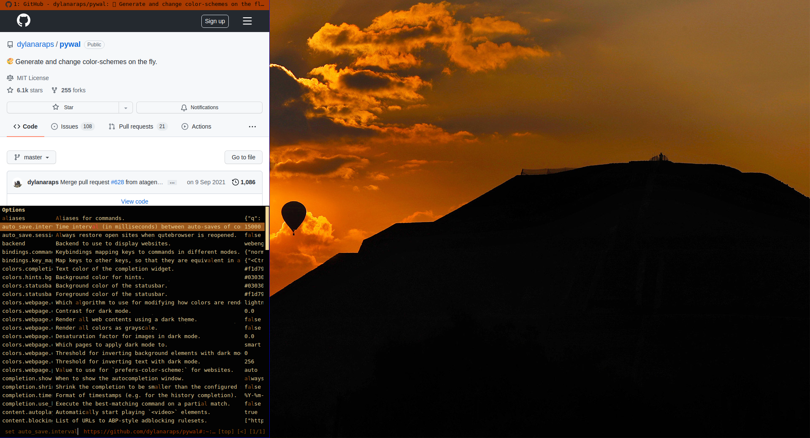
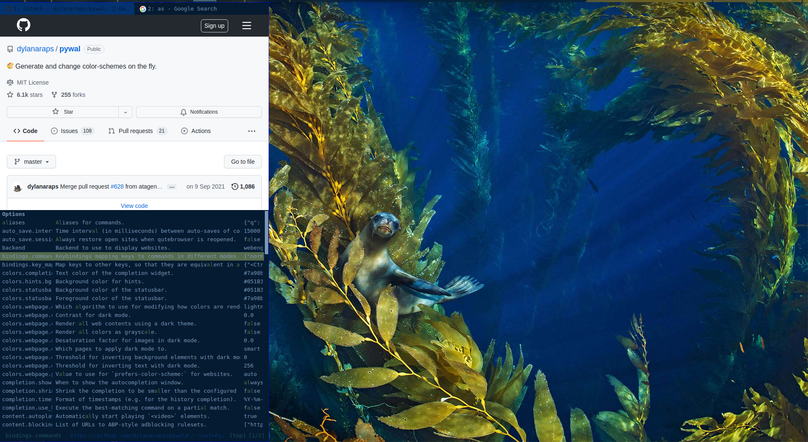
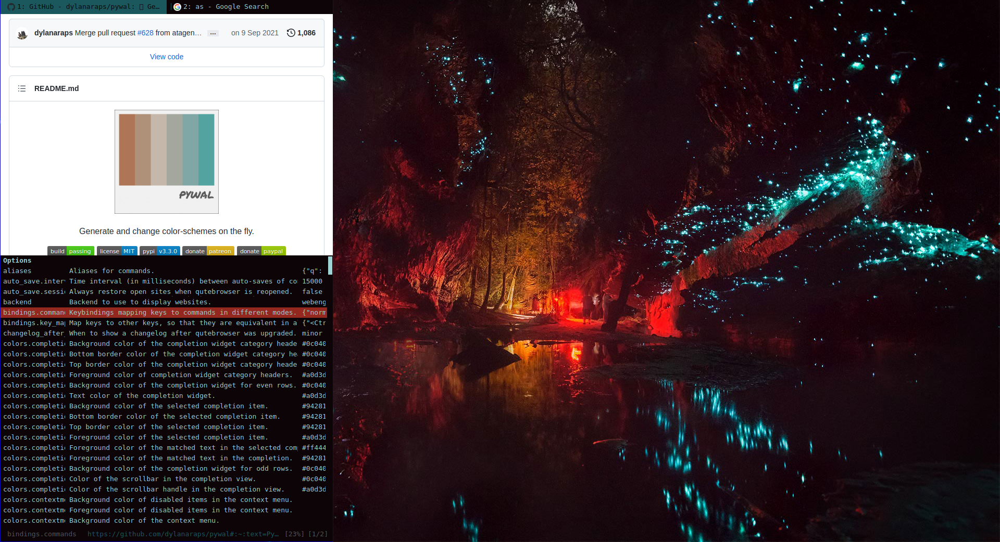
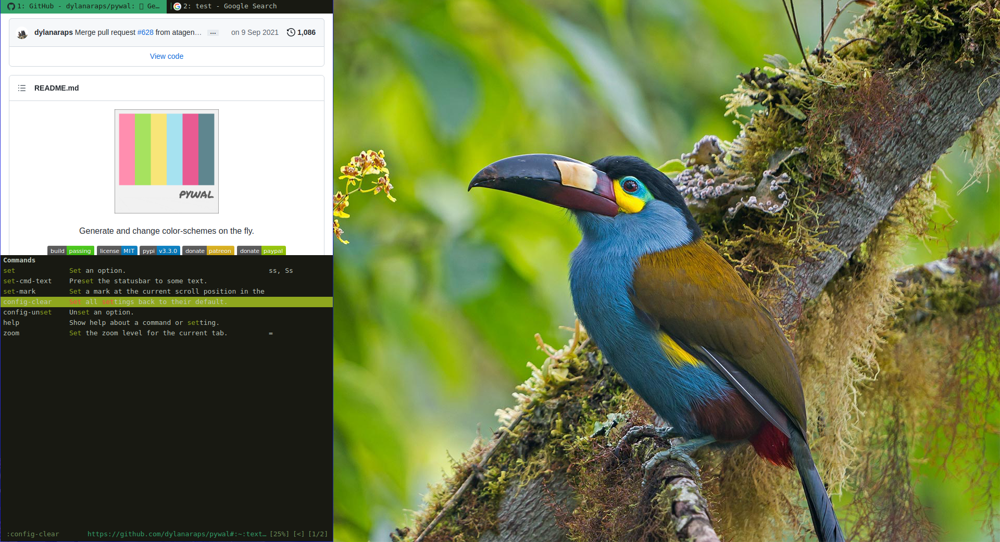

# pywal for [qutebrowser](https://www.qutebrowser.org/)

> A theme for [qutebrowser](https://www.qutebrowser.org/) that integrates it with [pywal](https://github.com/dylanaraps/pywal).


## Install

### [qutebrowser](https://www.qutebrowser.org/)
### [pywal](https://github.com/dylanaraps/pywal)

#### Install using Git

If you are a git user, you can install the theme and keep up to date by cloning the repo:

    $ git clone https://github.com/makman12/pywalQute.git

#### Install manually

Download using the [GitHub .zip download](https://github.com/makman12/pywalQute.git) option and unzip.

#### Activating theme

- Find your _[qutebrowser configuration directory](https://www.qutebrowser.org/doc/help/configuring.html#configpy)_ (see e.g. `:version` in qutebrowser). This folder should be located at the "config" location listed on qute://version, which is typically ~/.config/qutebrowser/ on Linux. I just assume that your pywal keeps its files in ~/.cache/pywal if not just fix the code its pretty simple.
- Move the repository folder to `pywalQute` inside the configuration directory.
- In your [qutebrowser config.py file](https://www.qutebrowser.org/doc/help/configuring.html#configpy), include the following:

```python
import pywalQute.draw

config.load_autoconfig()

pywalQute.draw.color(c, {
    'spacing': {
        'vertical': 6,
        'horizontal': 8
    }
})
```


## Team

There is no team. I just forked this theme from dracula [draculatheme.com/qutebrowser].

## More Screenshots





